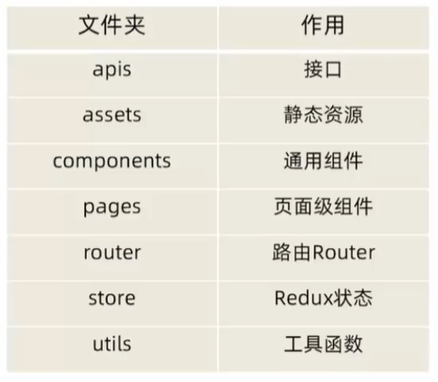
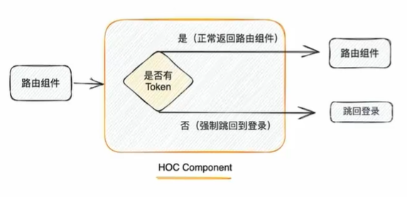

## 项目目录（src目录下）




## 安装SCSS
> 用CRA创建的项目有一定的封装，只需要安装css预处理器就行
- pnpm install sass -D

## 安装 Ant Design 组件库
- pnpm install antd --save

## 配置路由Router

## 配置别名路径

## 封装request请求模块

 - 一样的接口域名
 - 一样的超时时间
 - Token权限处理


1. 根域名配置
2. 超时时间
3. 请求拦截器 / 响应拦截器

```javascript
/**
 * 1. 根域名配置
 * 2. 超时时间
 * 3. 请求拦截器 / 响应拦截器
 */

import axios  from "axios";

const request = axios.create({
    baseURL : 'xxxxx', // 根域名
    timeout: 5000 //超时
})

// 请求拦截器
request.interceptors.request.use((config) =>{
    return config
},(error)=>{
    return Promise.reject(error);
})

//响应拦截器
request.interceptors.response.use((response)=>{
    return response.data
},(error)=>{
    return Promise.reject(error);
})

export {request}
```

在utils中创建index做中转导出
```javascript
/**
 * 统一中转函数
 */
import {request} from "./request";

export {
    request
}
```

## Redux （Token管理）

user相关状态管理

```javascript
import {createSlice} from "@reduxjs/toolkit";

createSlice({
    name : 'user',

    initialState:{
        token: ''
    },
    reducers: {
        setToken(state,action){
            state.token = action.payload
        }
    }
})

const {setToken} = userStore.actions

const userReducer = userStore.reducer

export {setToken}

export default userReducer
```

- token 异步获取存入Redux

```javascript
// 异步方法 获取Token
const fetchLogin = (loginForm)=>{
    return async (dispatch)=>{
        // 发送异步请求
        const res =await request.post('/authorizations',loginForm)
        //提交同步action进行token的存入
        dispatch(setToken(res.data.token))
    }
}
```

- token 持久化
> Redux基于浏览器内存，刷新后清除内存数据

  1. Redux + localStorage 方案 
 `初始化Token时： localStorage ? localStorage : ''`
  2. Redux Persist 插件让Redux具有持久化的特性 
  `pnpm i redux-persist`

```javascript
import {configureStore} from '@reduxjs/toolkit'
import counterReducer  from "./modules/counterStore";
import channelReducer from "./modules/channelStore";
import userReducer from "./modules/userStore";


import storage from 'redux-persist/lib/storage';
import { combineReducers } from 'redux';
import { persistReducer } from 'redux-persist';

// combineReducers合并reducer
const reducers = combineReducers({
    counter: counterReducer,
    channel: channelReducer,
    user: userReducer
});


// 持久化配置信息
const persistConfig = {
    key: 'token',
    storage,
    // 黑名单 不缓存的
    // blacklist:['xxx']
    whitelist: ['user']
};

const persistedReducer = persistReducer(persistConfig, reducers);


//创建store组合子模块
const store = configureStore({
    reducer: persistedReducer,
    /**
     * A single reducer function that will be used as the root reducer, or an
     * object of slice reducers that will be passed to `combineReducers()`.
     */
//  reducer: Reducer<S, A, P> | ReducersMapObject<S, A, P>

    /**
     * 要安装的Redux中间件数组。如果未提供，默认为 ' getDefaultMiddleware() '返回的中间件集合。
     */
// middleware?: ((getDefaultMiddleware: CurriedGetDefaultMiddleware<S>) => M) | M

    /**
     * 是否集成Redux DevTools。默认为“true”。
     *
     * 额外的配置可以通过传递Redux DevTools选项来完成
     */
// devTools?: boolean | DevToolsOptions

    /**
     * 初始状态，与Redux的createStore相同。
     * 您可以选择指定它来水合物状态
     * 从服务器中通用的应用程序，或者恢复一个以前序列化的
     * 用户会话。如果你使用' combineReducers() '来生成根减速器
     * 函数(直接或间接通过传递一个对象作为' reducer ')，
     * 这个对象必须与reducer映射键具有相同的形状。
     */
// preloadedState?: P

    /**
     * 初始状态，与Redux的createStore相同。
     * 您可以选择指定它来水合物状态
     * 从服务器中通用的应用程序，或者恢复一个以前序列化的
     * 用户会话。如果你使用' combineReducers() '来生成根减速器
     * 函数(直接或间接通过传递一个对象作为' reducer ')，
     * 这个对象必须与reducer映射键具有相同的形状。
     */
// enhancers?: (getDefaultEnhancers: GetDefaultEnhancers<M>) => E | E
})

export default store
```


## 初始化样式
```npm
pnpm install normalize.css
```

## token处理相关

- 请求注入token
```javascript
// 请求拦截器
request.interceptors.request.use((config) =>{
    // 注入TOKEN
    const token = getToken();
    if (token){
        config.headers.Authorization = `Bearer ${token}`
    }
    return config
},(error)=>{
    return Promise.reject(error);
})
```

- Token做路由权限控制
> 用高阶组件的方式 判断是否存在token，有则返回正常组件，无则返回登录


```javascript
<AuthRoute> <Layout /></AuthRoute>
```

```javascript
import {getToken} from "@/utils";
import { Navigate } from 'react-router-dom'

export function AuthRoute ({ children }) {
  const token = getToken();
  if (token) {
    return <>{children}</>
  } else {
    return <Navigate to={'/login'} replace />
  }
}
```

- 处理token失效

 1. 在响应拦截器中拦截 401 状态的请求，标识当前token失效
 2. 跳转登录 

```js
 // token失效
if (error.response.status === 401){
    router.navigate('/login');
    // 强制刷新
    window.location.reload();
}
return Promise.reject(error);
```

## 根据当前路由高亮菜单

- 获取当前路由路径
利用React提供的钩子函数
```js
  const location = useLocation()
console.log(location.pathname)
const selectedkey = location.pathname
```
- 找到菜单组件负责高亮属性，绑定当前的路由路径


## 富文本
> React18

- 安装
```npm
 pnpm install react-quill@2.0.0-beta.2
```

- 使用
```js
import ReactQuill from 'react-quill'
import 'react-quill/dist/quill.snow.css'

<ReactQuill
className="publish-quill"
theme="snow"
placeholder="请输入文章内容"
    />
```

## 枚举匹配（TS）

> 当某些字段需要在前端根据字段不同展示不同内容，并且字段状态有多个

## 基础打包和本地预览

- 打包
```npm
pnpm run build
```

- 本地预览

```npm
npm install -g serve
  serve -s build
```


