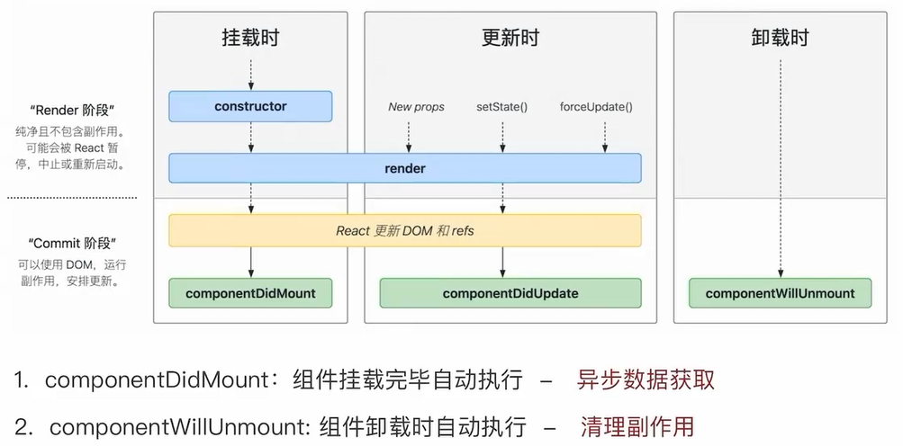

# 类组件

## 基本解构

- 通过书写state定义状态数据
- 通过setState方法来修改状态数据
- 通过render来写UI模板（JSX）

```js
class Counter extends Component{
    // 定义状态变量
    static = {
        count: 0
    }

    // 事件回调
    clickHandler = () =>{
        this.setState({
            count: this.state.count + 1
        })
    }

    // UI模板
    render (){
        return <button onClick={this.clickHandler}>{this.static.count}</button>
    }
}
```

## 生命周期函数



```js
  componentDidMount(){
            console.log('渲染完毕');
        }
        
        // 副作用清除
        componentWillUnmount(){
            console.log('组件卸载了')
        }
```

## 组件通讯
> 与Hook思想一致

- 父传子：通过prop绑定
```js
    class Son extends Component{
    render (){
        return <div>Son{this.props.msg}</div>
    }
}

class Parent extends Component{
    state = {
        ms: 'smz'
    }
    render (){
        return
        <div>
            Parent
            <Son msg={this.state.msg}/>
        </div>
    }
}
```
- 子传父：通过prop绑定父组件中的函数，子组件调用

```js
    class Son extends Component{
    render (){
        return <>
            <div>Son</div>
            <button onClick={()=>this.props.onMsg('smz')}></button>
        </>
    }
}

class Parent extends Component{
    state = {

    }
    getSonMsg=(msg)=>{
        console.log(msg)
    }
    render (){
        return <>
            <div>Parent<Son  onMsg={this.getSonMsg}/></div>
        </>
    }
}
```
- 兄弟通讯：状态提升，通过父组件做桥接