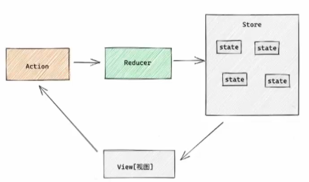

# Redux 

## 概念

> Redux是React最常用的状态管理工具，通过集中管理的方式管理应用的状态。可独立于框架运行。



- state 一个对象 存放管理的数据状态
- action 一个对象 用来描述如何修改状态
- reducer 一个函数 根据action的描述生成一个新的state

## 基础使用

```javascript
 <!DOCTYPE html>
<html lang="en">
    <head>
    <meta charset="UTF-8">
    <title>Title</title>
</head>
<body>
    <button id="decrement">-</button>
    <span id="count">0</span>
    <button id="increment">+</button>

    <script src="https://cdn.bootcdn.net/ajax/libs/redux/4.2.1/redux.min.js"></script>
    <script>
        /**
        * 1. 定义reducer函数 ：更具不同的action对象，返回不同的新的state
        * 2. 使用reducer函数生成store实例
        * 3. 通过store实例的subscribe订阅数据变化
        * 4. 通过store实例的dispatch函数提交action更改状态
        * 5. 通过store实例的getState方法获取最新状态
        */

        // 1
        function reducer(state = {count : 0},action) {
        if (action.type === 'INCREMENT'){
        return {count: state.count + 1}
    }
        if (action.type === 'DECREMENT'){
        return {count: state.count - 1}
    }
        return state;
    }

        // 2
        const store = Redux.createStore(reducer);

        // 3
        store.subscribe(()=>{
        document.querySelector('#count').innerText = store.getState().count;
    })

        // 4
        const inBtn = document.querySelector('#decrement');
        inBtn.addEventListener('click',()=>{
        store.dispatch({
            type: 'DECREMENT'
        })
    })
        const inBtn2 = document.querySelector('#increment');
        inBtn2.addEventListener('click',()=>{
        store.dispatch({
            type: 'INCREMENT'
        })
    })

        //5

    </script>
</body>
</html>
```


## React 使用Redux

>在React使用Redux需要安装两个插件

- Redux Toolkit
简化书写方式，内置工具集
  1. 创建状态仓库，并导出更新方法，与创建方法
  2. 将所有状态仓库整合到一块进行中央管理

    
```javascript
import {createSlice} from '@reduxjs/toolkit'

const counterStore = createSlice({
    name: 'counter',
    //初始化
    initialState:{
        count: 0
    },
    //修改数据同步方法
    reducers: {
        increment (state){
            state.count++
        },
        decrement (state){
            state.count--
        }
    }
})

// 解构创建action对象函数
const {increment,decrement} =counterStore.actions
//获取reducer函数
const counterReducer = counterStore.reducer;
//导出修改状态方法
export {increment,decrement}
export default counterReducer
```

```javascript
import {configureStore} from '@reduxjs/toolkit'
import counterReducer  from "./modules/counterStore";

//创建store组合子模块
const store = configureStore({
    reducer: {
        counter: counterReducer
    }
})
export default store
```

- react-redux
链接React与Redux,为React注入store，
    1. 内置了Provider组件，通过store参数把创建好的store实例注入到应用中,在入口文件中

    2. 使用 useSelector，将store中的数据映射到组件中 

    3. 使用useDispatch函数,调用该函数，传入对应action对象，修改状态


```javascript
root.render(
    <Provider store={store}>
        <App />
    </Provider>
);
```

```javascript
const {count} = useSelector(state => state.counter);
```

```javascript
import {decrement, increment} from "./store/modules/counterStore";
const dispatch = useDispatch();
return (
    <div className="App">
        <button onClick={()=>dispatch(decrement())}>-</button>
        <span>{count}</span>
        <button onClick={()=>dispatch(increment())} >+</button>
    </div>
);
}
```

目录结构：
  - store
    - index.js
    - modules
       - 状态文件


## 提交action参数

> 与其它不传参方法基本一致，只在传参多了一个action参数对象，其中action有固定属性 `payload`用来取出传递参数


```javascript
 addToNum(state,action){
            state.count = action.payload;
        }
```

```javascript
 <button onClick={()=>dispatch(addToNum(20))} >TO 20</button>
```

## 异步控制状态

- 创建store的写法保持不变，配置好同步修改状态的方法
- 单独分装一个函数，在函数内部reture一个新函数，在新函数中
   - 封装异步请求获取数据
   - 调用actionCreater传入异步数据生成一个action对象，并使用dispatch提交
- 组件中dispatch的写法不变,将第二步的函数看作action使用dispatch提交

```javascript
import {createSlice}   from "@reduxjs/toolkit";
import axios from "axios";
const channelStore = createSlice({
    name: 'channel',
    initialState:{
        channelList: []
    },
    reducers:{
        setChannels (state, action){
            state.channelList = action.payload;
        }
    }
})


```

```javascript
// 异步请求
const {setChannels}= channelStore.actions
const fetchChannlList = ()=>{
    return async (dispatch)=>{
        const res =await axios.get('http://localhost:5000/list');
        dispatch(setChannels(res.data));
    }
}

export {fetchChannlList}

const reducer = channelStore.reducer;

export default reducer;
```


```javascript
useEffect(()=>{
    dispatch(fetchChannlList())
},[dispatch]);

```


## 获取切片数据
```javascript
import {useSelector} from 'react-redux'
// 获取user切片数据 state 为Redux容器所有数据
const user = useSelector(state => state.user);

```