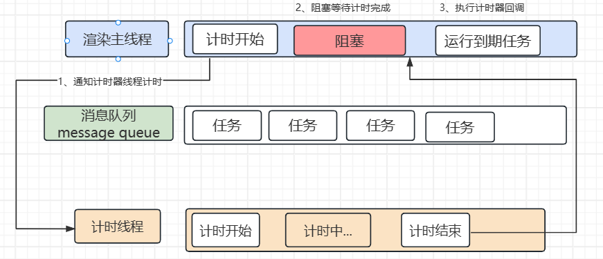

# 进程与线程
## 进程
### 进程的概念
>进程是操作系统中的一个程序或者一个程序的一次执行过程，是一个动态的概念，是程序在执行过程中分配和管理资源的基本单位，是操作系统结构的基础。

简单的来说，就是一个程序运行开辟的一块内存空间，值得注意的是，一个程序至少有一个进程，进程之间是相互`独立`的。
## 线程
### 线程的概念
>线程是进程中的一个实体，是被系统独立调度和分派的基本单位，是比进程更小的能独立运行的基本单位。

简单的来说，就是执行程序的通道，一个进程至少有一个线程，在进程开启后自动创建一个线程，这个线程称为`主线程`，线程之间是`共享`进程的内存空间的。
# 浏览器进程与线程
浏览器是一个`多进程``多线程`的应用程序

这是因为浏览器防止连环崩坏，避免相互影响，其中重要的进程有：浏览器进程、渲染进程、网络进程等。

每个标签页都是一个渲染进程，每个进程都是独立的，互不影响，所以当一个标签页崩溃时，不会影响其他标签页。

`注：现在浏览器的渲染进程改变了，不再是一个标签一个进程，转换为相同站点为一个进程 时间2023/10/25`

## 浏览器进程
主要负责界面显示（标签、前进、后退、导航栏等）、用户交互、子进程管理（网络、渲染进程等）、提供存储等功能。内部会启动多个线程处理不同的任务。
## 网络进程
负责网络加载资源，主要是通过网络请求获取数据，然后传递给渲染进程。内部会启动多个线程处理不同的任务。
## 渲染进程
渲染进程启动后，会开启一个渲染主线程，负责执行 HTML、CSS、JavaScript。

### 渲染主线程
渲染主线程负责：
- 解析 HTML，生成 DOM 树
- 解析 CSS，生成 CSSOM 树
- 计算样式
- 布局
- 处理图层
- 每秒把页面渲染到屏幕上 60 次（不同的设备刷新率不同）
- 执行全局JS代码
- 执行事件处理函数
- 执行计时器的回调函数
- ...

>为什么渲染进程不适合多个线程？
> 
如果渲染进程有多个线程，那么多个线程会共享渲染进程的内存空间，这样会导致多个线程之间相互影响，造成页面崩溃。

# 浏览器事件循环
在渲染主进程中的多个任务执行，如何做到任务调度 ===> 排队执行

## 任务队列
任务队列是一个先进先出的队列，用来存储将要执行的任务，渲染主线程，从任务队列拿任务执行。

>渲染主线程流程：
> 
1.  进入无限循环，不断从任务队列中取出任务执行
2.  每次检查任务队列是否有任务，如果有，就取出任务执行，没有就等待任务加入任务队列
3.  其他线程的任务可随时加入任务队列末尾

## 异步任务
代码在执行过程中，会遇到一些无法立即处理的任务，比如：

- 计时完成后需要执行的任务：setTimeout、setInterval
- 网络通讯完成后需要执行的任务：XHR、Fetch
- 用户操作后需要执行的任务：addEvaentListener

如果让渲染主线程等待这些任务的执行，将会导致主线程长期处于`阻塞`状态，导致浏览器奔溃

这里使用异步的方式保证主线程不阻塞

>如何理解 JS 的异步？
> 
JS是一门单线程的语言，因为JS执行在渲染主线程中，为了防止渲染主线程的阻塞，采用异步的方式，碰到耗时任务时交给其他线程处理，自生立即结束当前任务，执行后续任务，而耗时任务的回调函数包装成任务，加到任务队列中末尾，等待调度执行

## 任务优先级

任务没有优先级，但是任务队列是有优先级的

- 每个任务都有一个任务类型，同一个类型的任务必须在同一个队列，不同类型的任务可分属于不同的队列（也可以将两种或多种类型的任务放在同一个队列）
  在一次事件循环中，浏览器可以根据实际情况从不同的队列中取出任务执行
- 浏览器必须有一个微任务队列，优先执行微任务队列里的任务

在 chrome 中，至少包含以下队列：
 
- 延时队列：用于存放计时器的回调任务，优先级===》中
- 交互队列：用于存放用户操作后产生的事件处理任务，优先级===》高
- 微队列：用于存放需要最快执行的任务，优先级===》最高

添加微队列的方式主要包括：Promise、MutationObserver

