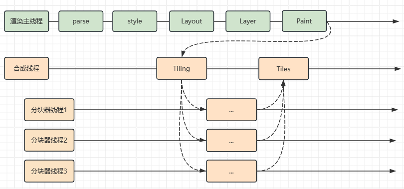
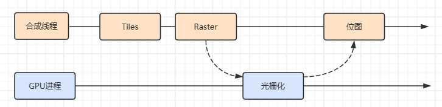
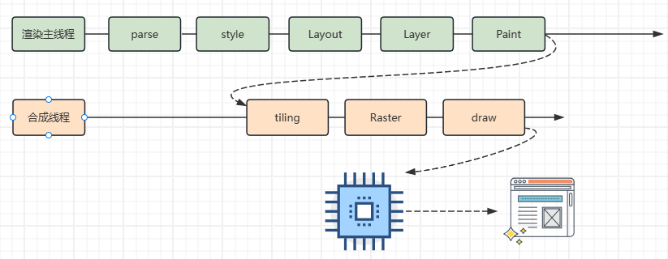
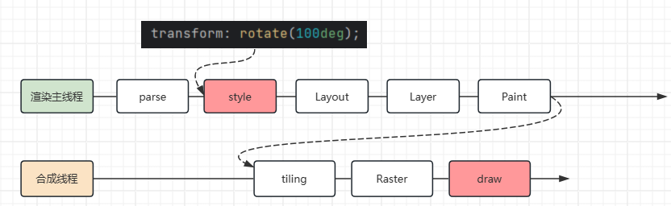
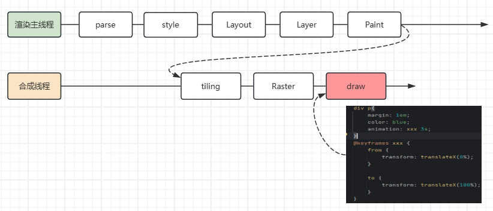
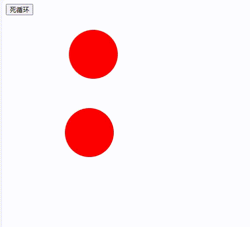
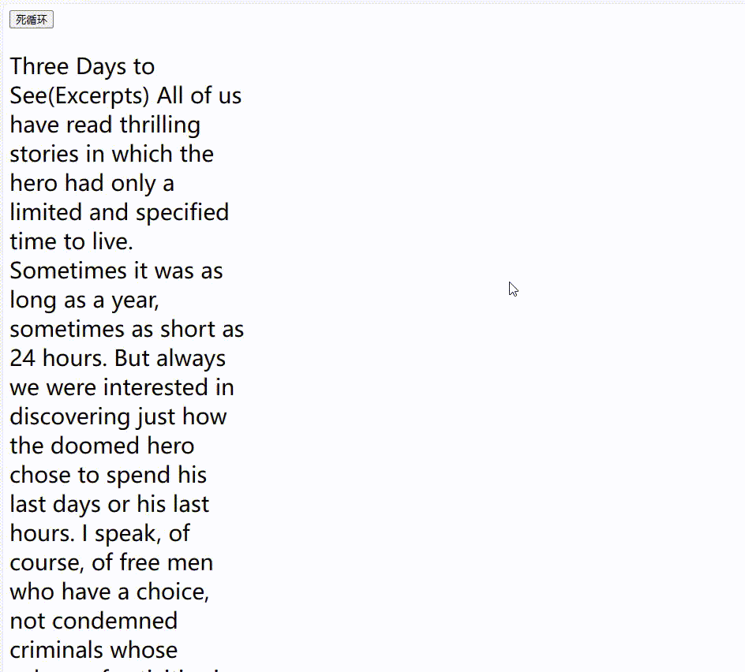

# 渲染
>浏览器的渲染就是通过一个函数，将html文档字符串经过一系列的处理，将浏览器上每个像素点的颜色计算出来，然后绘制到屏幕上。
> 

## 渲染时间点
>浏览器的渲染过程是在html文档加载完成后，解析完成后，才开始的。
> 
在浏览器输入URL地址时，会分成两个部分，一部分是网络请求，一部分是浏览器的渲染。

- 网络请求中，会经历DNS解析，TCP连接，发送请求，接收响应。
- 渲染中，会经历解析html，构建DOM树，构建CSSOM树，合并成渲染树，布局渲染树，绘制渲染树，重绘重排，合成绘制，显示到屏幕上。


## 浏览器是如何渲染的

当浏览器的网络线程收到 `HTML` 文档后，会产生一个渲染任务，并将其传递给渲染主线程的消息队列。在事件循环机制的作用下，渲染主线程执行渲染任务，开始渲染流程

整个渲染流程分为很多个阶段，每个阶段都会产生一个任务，这些任务会被添加到消息队列中，等待渲染主线程执行。这些任务分别是：Html解析、样式计算、布局、分层、绘制、分块、光栅化、合成、显示。每个阶段都有明确的输入和输出，上个阶段的输出会变成下个阶段的输入。


---

- 渲染第一步是解析 HTML
 
解析过程中遇到 CSS 解析 CSS， 遇到JS 执行 JS代码。为了提高解析效率，浏览其在解析前，会启动一个预解析的线程，率先下载 HTML 中的外部CSS文件和外部的JS文件。

如果主线程解析到`link`位置，此时外部的CSS文件还没下载解析好，主线程不会等待，继续解析后续的 HTML 。这是因为下载和解析CSS是在预解析线程中进行的。这就是 CSS不会阻塞HTML 解析的根本原因。

如果主线程解析到`script`位置，会停止解析 HTML，转而等待JS文件下载，并将全局JS代码解析完成后，才能继续解析HTML。这是因为 JS代码可能会修改当前DOM树，所以DOM树的生成必须暂停。这就是JS会阻塞HTML解析的根本原因。

第一步完成后，会得到 `DOM` 和 `CSSOM` 树。


---

- 第二步是样式计算（将DOM和CSSOM树结合）

主线程会遍历得到的 `DOM` 树，依次为术中的每个节点计算出他的最终样式，称为 Computed Style.

在这以过程中，很多预设值会变成绝对值，比如`red`会变成`rgb(255,0,0)`;相对单位会变成绝对单位，比如`em`会变成`px`

这一步完成后，会得到一颗带有样式的 `DOM` 树。


---


- 第三步是布局（Layout）

在布局完成后会得到布局树。
布局阶段会依次遍历 `DMO` 树的每一个节点，计算每个节点的几何信息。例如宽高、相对包含快的位置。

大部分时候， `DOM`树和布局树无法一一对应。
比如`display:none`的节点没有几何信息，因此不会生成到布局树，又比如使用了伪元素选择器，虽然 `DOM` 树中不会存在这些元素节点，但他拥有几何信息，所以会生成到布局树中。其他包括匿名行盒、匿名块盒都会导致不是一一对应。

---

- 第四层是分层（Layer）

主线程会使用一套复杂的策略对整个布局树中进行分层。

分层的好处在于，将来某一个层改变，仅会对该层进行后续处理，从而提升效率。

滚动条、堆叠上下文、transform、opacity 等样式都会影响分层结果，也可以通过`will-change`属性更大程度的影响分层结果

---

- 第四步是绘制（Paint）

主线程会为每个层单独产生绘制指令集，用于描述这一层如何绘制出来。

---

- 分块（Tiling）

完成绘制后，主线程将每个图层的绘制信息交给合成线程，剩余工作由合成线程完成

合成线程首先对每个图层进行分块，将其划分为更多的小区域。

它会从线程池中拿取多个线程来完成分块工作。

---

- 光栅化（Raster）

分块完成后，进入光栅化阶段。

合成线程会将块信息交给 `GPU`进程，以极快的速度完成光栅化。

`GPU`进程会开启多个线程来完成光栅化，并且优先处理靠近视口区域的块。

光栅化的结果，就是一块一块的位图

---

- 合成（Draw）

合成线程拿到每个图层、每个块的位图后，生成一个个[指引（quad）]信息。

指引会标识出每个位图应该画到屏幕的哪个位置，以及会考虑到旋转、缩放等变形。

变形发生在合成线程，与渲染线程无关，这就是 `transform`效率高的本质原因。

---

- 显示

合成线程会把 quad 提交给 `GPU`进程，由`GPU`进程产生系统调用，提交给`GPU`硬件，完成最终的屏幕成像。

---


### 1、HTML解析
产生DOM树和CSSOM树，本质上这两颗树就是两个对象，为了让后续操作更方便，开放了JS可操作树的操作。

- DOM(Document Object Model)树：描述HTML文档的结构


- CSSOM(CSS Object Model)树：描述CSS文档的结构

样式表分为：内联样式表、外联样式表、行内样式、浏览器默认样式。
这些都会经过解析变成CSSOM树，其中`StyleSheetList`表示整个树根，`CSSStyleSheet`表示每一个样式表，`CSSStyleRule`表示每一个花括号的规则信息。


>一般可以通过 `dom元素.style` 的方式操作行内样式，通过 `document.styleSheets` 的方式获取整个样式表来操作


[谷歌浏览器Githup源码](https://github.com/chromium/chromium/tree/main)

`注：谷歌浏览器默认样式目录为:third_party/blink/renderer/core/html/resources/html.css`

---
- 遇到 CSS 代码

当在解析`HTML`字符串的时候，遇到`CSS`代码时，主线程解析CSS生成CSSOM树会很麻烦，为了提高解析效率：

在解析时会创建一个子线程：预解析线程 进行快速浏览，遇到link 外部CSS时，下载CSS并执行解析，使主线程能更快的生成CSSOM树，主线程并不会停止。


- 遇到 JS 代码

渲染主线程遇到 JS 时必须暂停一切行为，等待下载完成后才能继续。
预解析线程可以分担一点下载 JS 的任务。


---

### 2、样式计算
样式计算，就是将DOM树和CSSOM树结合，让DOM树拥有最终样式。
此时，css属性值的计算过程：层叠、继承；视觉格式化模型：盒模型、包含快、流式布局、浮动布局、BFC等，都在该阶段执行。

在JS中也可以通过`getComputedStyle`获取 最终计算的样式，如下：
```javascript
let elem1 = document.getElementById("box");
let style = getComputedStyle(elem1, null);
// 等价于
let style = document.defaultView.getComputedStyle(elem1, null);
```


- 层叠
- 继承


### 3、布局
布局，主要就是确定节点宽高和位置，其中位置是相对包含块的位置。

布局树中暴露出了部分可以用JS获取布局树的信息，如

```javascript
document.body.clientHeight
```


`注：某些宽高在样式计算的时候是计算不出来的，如：不是绝对值的节点`


- 包含块
- 匿名盒
  在布局树中，存在以下规则：
   - 内容必须在行盒中
   - 行盒和块盒不能相邻


`谷歌浏览器源码位置：third_party/blink/renderer/core/layout`


### 4、分层
分层的目的在于优化，旧版本浏览器时没有这一步的，因为在后续中，页面会发生变化，变化会导致浏览器重新渲染整个页面，分层就将整个页面分成几个图层，当某个图层改变时，只重新渲染那个图层。
但是如何分层取决于内存的因素。


在不同浏览器中分层有不同的策略，图层是可以在控制台查看的，如：

- Edge：3d视图

- Chrome: layers


堆叠上下文、滚动条、transform、opacity 会影响分层策略，如`will-change : 变动的属性`，浏览器会自行决定是否将应用这个属性的容器进行单独分层。

对一些经常发生改变的元素进行独立分层，达到更快的渲染效果，如滚动条在分层时是独立的一个图层。

`注：不要滥用 will-change ，在渲染遇到分层导致的性能问题再使用，滥用会导致内存占用过高，导致奔溃`


### 5、绘制
这里的绘制，是为每一层生成如何绘制的指令，如：
1. 移动到 10，30 位置
2. 画一个200*300的矩形
3. 用红色填充

这里的绘制，就和canvas一样，canvas就是浏览内核暴露出来的绘制功能。

>这一步之后，其余工作将交于其他线程完成。


`谷歌浏览器绘制源码位置：third_party/blink/renderer/core/paint`

### 6、分块
分块会将每一层分为多个小的区域，是浏览器做的一种优化，分成块后，可以在后续优先渲染某个块，比如靠近视口区域的块优先渲染。




### 7、光栅化
光栅化是将每个块变成位图，每个像素点的颜色

优先处理靠近视口的块。

光栅化过程会用到 `GPU`加速



### 8、合成

在这个阶段，会将位图标识渲染在屏幕的哪个地方，和 布局不同的是，布局相对于页面，而合成则是相对于屏幕。

这一步还会确认旋转、缩放等变形，通过分块进行矩阵变换，来改变显示信息。


### 9、显示

合成线程会把 `quad`信息转交给`GPU`进程，让`GPU`进程再转交给系统硬件显卡，显卡将其绘制。

这里会有一个疑问：那为什么合成线程不直接将信息交给硬件呢？

>原因是：合成线程并没有操作系统的能力，这样做的目的是为了安全，合成线程是属于渲染进程的，渲染进程是放在沙盒中的，与操作系统硬件隔离的，当浏览器受到一些恶意插件、病毒的攻击，他不会影响操作系统，只会影响浏览器页面。所以只能通过 `GPU`进程调用系统接口。


### 完整流程




---

# 其他
## 回流（reflow）与重绘
- 回流（reflow）

回流的本质就是重新计算 `latout` 树。

当进行了会影响布局树的操作后，需要重新计算布局树，会引发 `layout`以及后续步骤的重新执行。

为了避免连续多次的操作导致布局树反复计算，浏览器会合并这些操作，当 JS代码全部完成后再进行统一计算，也就是创建一个异步任务加入到队列中。所以，改动属性造成的 `reflow`是异步完成的。

```javascript
    elem1.style.width = '100px'
    elem1.style.height = '100px'
    elem1.style.padding = '100px'
```


但是，这样会导致 在 JS 获取布局属性时，可能造成无法获取到最新的布局信息，最终浏览器决定在获取属性的时候立刻 `reflow`

后续也可以读取任意布局属性，来强制 `reflow`

```javascript
    elem1.clientHeight // 可能无法得到最新值
```


- 重绘(repaint)

重绘的本质就是重新根据分层信息计算绘制指令。也就是 可以跳过`layout` 步骤,甚至`layer`也可以跳过，执行`paint`和后续步骤。

改动可见样式后，就需要重新计算，会引发 `repaint`。

由于元素的布局信息也属于可见样式，所以 `reflow` 一定会引起 `repaint`

---

## 堆叠上下文（stack context）
它是一块区域，这块区域由某个元素创建，它规定了该区域中的内容在Z轴上排列的先后顺序。

### 创建堆叠上下文的元素

1. html元素 （根元素）
2. 设置了 z-index（非auto）数值的定位元素


### 同一个堆叠上下文中的元素在Z轴上的排列
从后到前的排列顺序，当出现相同状态的是，后面的元素覆盖前面的元素。

1. 创建堆叠上下文的元素的背景和边框
2. 堆叠级别为负值的堆叠上下文
3. 常规流非定位块盒
4. 非定位的浮动盒子
5. 常规流非定位行盒
6. 任何 z-index 是 auto 的定位子元素，以及 z-index 是 0 的堆叠上下文
7. 堆叠级别为正值的堆叠上下文


`每个堆叠上下下文，独立于其他堆叠上下文`

---

## transform 
为何 `transform` 效率高，主要原因就在于它所影响的是合成线程`Draw` 步骤，并不会影响主线程。
而且在使用 JS 改变 `transform` 值的时候，也只会影响主渲染进程 `Style` 和合成线程 `Draw`。





如果搭配 `animation` 时，使用 JS 改变 `transform` 值，则只会影响 合成线程`Draw` 步骤。



这里有个例子可以直观的感受 `transform` 的效率:



```html
<!DOCTYPE html>
<html lang="en">
<head>
    <meta charset="UTF-8">
    <title>Title</title>
</head>
<style>
    .ball{
        width: 100px;
        height: 100px;
        background: red;
        border-radius: 50%;
        margin: 30px;
    }
    .ball1 {
        animation: move1 1s alternate infinite ease-in-out;
    }
    .ball2{
        position: fixed;
        left: 0;
        animation: move2 1s alternate infinite ease-in-out;
    }
@keyframes move1 {
    to {
        transform: translate(100px);
    }
}
@keyframes move2 {
    to {
        left: 100px;
    }
}
</style>
<body>
<button id="btn">死循环</button>
<div class="ball ball1"></div>
<div class="ball ball2"></div>
<script>
  function delay(duration) {
      let start = Date.now()
      while(Date.now() -start < duration){}
  }
  btn.onclick = function () {
      delay(3000)
  }
</script>
</body>
</html>
```


而且，对于滚动条滚动，主线程阻塞，他是不会影响到滚动条的滚动渲染，因为，滚动条滚动只会影响合成线程的`Draw`步骤。



```html
<!DOCTYPE html>
<html lang="en">
<head>
    <meta charset="UTF-8">
    <title>Title</title>
</head>
<style>
    p {
        font-size: 28px;
        width: 300px;
    }
</style>
<body>
<button id="btn">死循环</button>
<p>
    Three Days to See(Excerpts)

    All of us have read thrilling stories in which the hero had only a limited and specified time to live. Sometimes it was as long as a year, sometimes as short as 24 hours. But always we were interested in discovering just how the doomed hero chose to spend his last days or his last hours. I speak, of course, of free men who have a choice, not condemned criminals whose sphere of activities is strictly delimited.

    Such stories set us thinking, wondering what we should do under similar circumstances. What events, what experiences, what associations should we crowd into those last hours as mortal beings, what regrets?

    Sometimes I have thought it would be an excellent rule to live each day as if we should die tomorrow. Such an attitude would emphasize sharply the values of life. We should live each day with gentleness, vigor and a keenness of appreciation which are often lost when time stretches before us in the constant panorama of more days and months and years to come. There are those, of course, who would adopt the Epicurean motto of “Eat, drink, and be merry”. But most people would be chastened by the certainty of impending death.

    In stories the doomed hero is usually saved at the last minute by some stroke of fortune, but almost always his sense of values is changed. He becomes more appreciative of the meaning of life and its permanent spiritual values. It has often been noted that those who live, or have lived, in the shadow of death bring a mellow sweetness to everything they do.

    Most of us, however, take life for granted. We know that one day we must die, but usually we picture that day as far in the future. When we are in buoyant health, death is all but unimaginable. We seldom think of it. The days stretch out in an endless vista. So we go about our petty tasks, hardly aware of our listless attitude toward life.

    The same lethargy, I am afraid, characterizes the use of all our faculties and senses. Only the deaf appreciate hearing, only the blind realize the manifold blessings that lie in sight. Particularly does this observation apply to those who have lost sight and hearing in adult life. But those who have never suffered impairment of sight or hearing seldom make the fullest use of these blessed faculties. Their eyes and ears take in all sights and sounds hazily, without concentration and with little appreciation. It is the same old story of not being grateful for what we have until we lose it, of not being conscious of health until we are ill.

    I have often thought it would be a blessing if each human being were stricken blind and deaf for a few days at some time during his early adult life. Darkness would make him more appreciative of sight; silence would teach him the joys of sound.
</p>
</body>
<script>
    function delay(duration) {
        let start = Date.now()
        while(Date.now() -start < duration){}
    }
    btn.onclick = function () {
        delay(3000)
    }
</script>
</html>
```


