# 渲染
>浏览器的渲染就是通过一个函数，将html文档字符串经过一系列的处理，将浏览器上每个像素点的颜色计算出来，然后绘制到屏幕上。
> 

## 渲染时间点
>浏览器的渲染过程是在html文档加载完成后，解析完成后，才开始的。
> 
在浏览器输入URL地址时，会分成两个部分，一部分是网络请求，一部分是浏览器的渲染。

- 网络请求中，会经历DNS解析，TCP连接，发送请求，接收响应。
- 渲染中，会经历解析html，构建DOM树，构建CSSOM树，合并成渲染树，布局渲染树，绘制渲染树，重绘重排，合成绘制，显示到屏幕上。

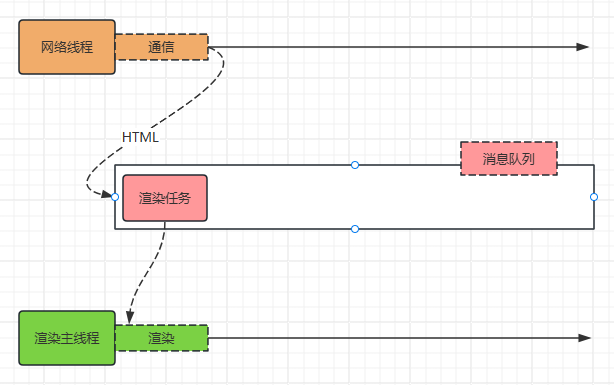

## 浏览器是如何渲染的

当浏览器的网络线程收到 `HTML` 文档后，会产生一个渲染任务，并将其传递给渲染主线程的消息队列。在事件循环机制的作用下，渲染主线程执行渲染任务，开始渲染流程

整个渲染流程分为很多个阶段，每个阶段都会产生一个任务，这些任务会被添加到消息队列中，等待渲染主线程执行。这些任务分别是：Html解析、样式计算、布局、分层、绘制、分块、光栅化、合成、显示。每个阶段都有明确的输入和输出，上个阶段的输出会变成下个阶段的输入。

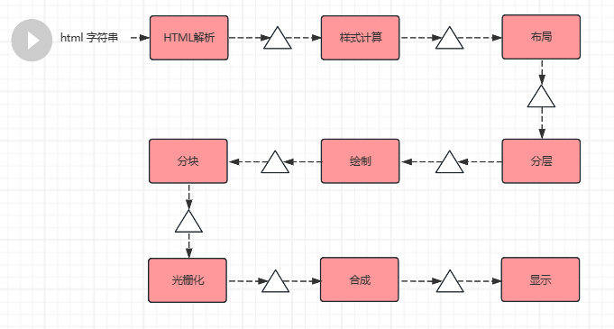

---

- 渲染第一步是解析 HTML
 
解析过程中遇到 CSS 解析 CSS， 遇到JS 执行 JS代码。为了提高解析效率，浏览其在解析前，会启动一个预解析的线程，率先下载 HTML 中的外部CSS文件和外部的JS文件。

如果主线程解析到`link`位置，此时外部的CSS文件还没下载解析好，主线程不会等待，继续解析后续的 HTML 。这是因为下载和解析CSS是在预解析线程中进行的。这就是 CSS不会阻塞HTML 解析的根本原因。

如果主线程解析到`script`位置，会停止解析 HTML，转而等待JS文件下载，并将全局JS代码解析完成后，才能继续解析HTML。这是因为 JS代码可能会修改当前DOM树，所以DOM树的生成必须暂停。这就是JS会阻塞HTML解析的根本原因。

第一步完成后，会得到 `DOM` 和 `CSSOM` 树。


---

- 第二步是样式计算（将DOM和CSSOM树结合）
主线程会遍历得到的 `DOM` 树，依次为术中的每个节点计算出他的最终样式，称为 Computed Style.

在这以过程中，很多预设值会变成绝对值，比如`red`会变成`rgb(255,0,0)`;相对单位会变成绝对单位，比如`em`会变成`px`

这一步完成后，会得到一颗带有样式的 `DOM` 树。


---


- 第三步是布局（Layout）
在布局完成后会得到布局树。
布局阶段会依次遍历 `DMO` 树的每一个节点，计算每个节点的几何信息。例如宽高、相对包含快的位置。

大部分时候， `DOM`树和布局树无法一一对应。
比如`display:none`的节点没有几何信息，因此不会生成到布局树，又比如使用了伪元素选择器，虽然 `DOM` 树中不会存在这些元素节点，但他拥有几何信息，所以会生成到布局树中。其他包括匿名行盒、匿名块盒都会导致不是一一对应。

---

- 第四层是分层（Layer）

主线程会使用一套复杂的策略对整个布局树中进行分层。

分层的好处在于，将来某一个层改变，仅会对该层进行后续处理，从而提升效率。

滚动条、堆叠上下文、transform、opacity 等样式都会影响分层结果，也可以通过`will-change`属性更大程度的影响分层结果

---

- 第四步是绘制（Paint）
主线程会为每个层单独产生绘制指令集，用于描述这一层如何绘制出来。

---


### 1、HTML解析
产生DOM树和CSSOM树，本质上这两颗树就是两个对象，为了让后续操作更方便，开放了JS可操作树的操作。

- DOM(Document Object Model)树：描述HTML文档的结构

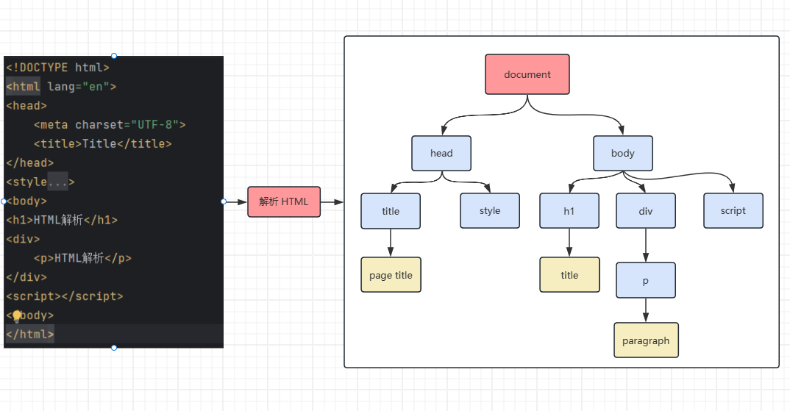
- CSSOM(CSS Object Model)树：描述CSS文档的结构

样式表分为：内联样式表、外联样式表、行内样式、浏览器默认样式。
这些都会经过解析变成CSSOM树，其中`StyleSheetList`表示整个树根，`CSSStyleSheet`表示每一个样式表，`CSSStyleRule`表示每一个花括号的规则信息。

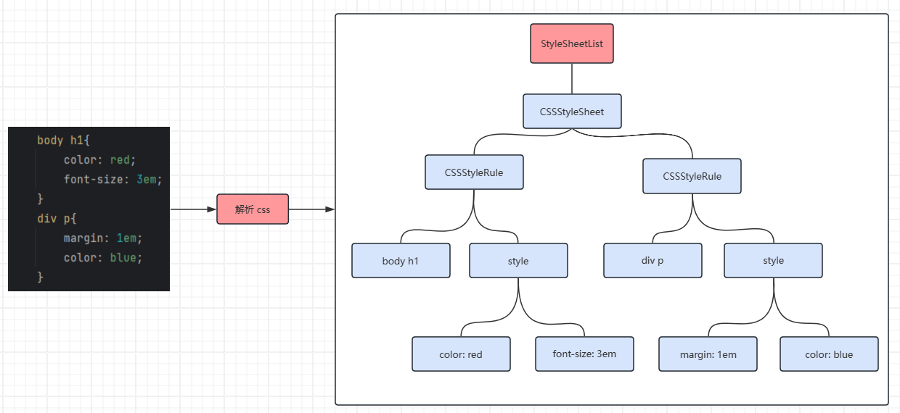

>一般可以通过 `dom元素.style` 的方式操作行内样式，通过 `document.styleSheets` 的方式获取整个样式表来操作

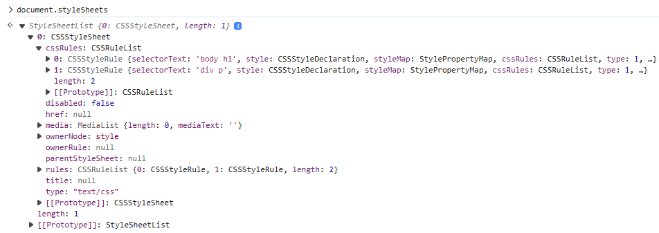

[谷歌浏览器Githup源码](https://github.com/chromium/chromium/tree/main)

`注：谷歌浏览器默认样式目录为:third_party/blink/renderer/core/html/resources/html.css`

---
- 遇到 CSS 代码

当在解析`HTML`字符串的时候，遇到`CSS`代码时，主线程解析CSS生成CSSOM树会很麻烦，为了提高解析效率：

在解析时会创建一个子线程：预解析线程 进行快速浏览，遇到link 外部CSS时，下载CSS并执行解析，使主线程能更快的生成CSSOM树，主线程并不会停止。

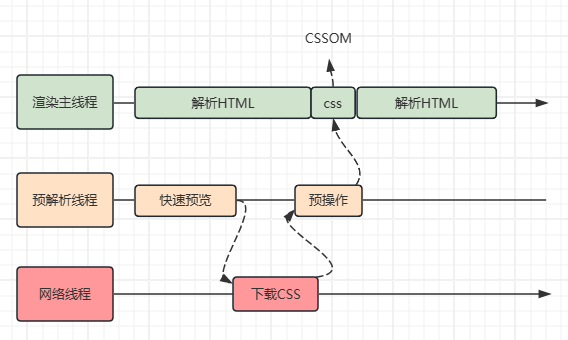

- 遇到 JS 代码

渲染主线程遇到 JS 时必须暂停一切行为，等待下载完成后才能继续。
预解析线程可以分担一点下载 JS 的任务。

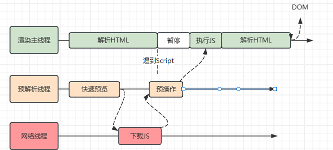


---

### 2、样式计算
样式计算，就是将DOM树和CSSOM树结合，让DOM树拥有最终样式。
此时，css属性值的计算过程：层叠、继承；视觉格式化模型：盒模型、包含快、流式布局、浮动布局、BFC等，都在该阶段执行。

在JS中也可以通过`getComputedStyle`获取 最终计算的样式，如下：
```javascript
let elem1 = document.getElementById("box");
let style = getComputedStyle(elem1, null);
// 等价于
let style = document.defaultView.getComputedStyle(elem1, null);
```
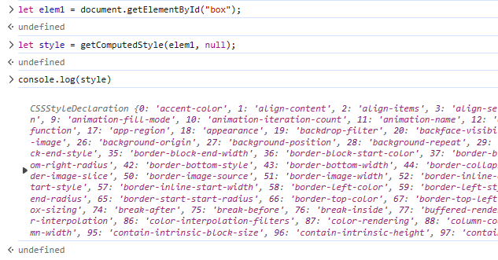


- 层叠
- 继承


### 3、布局
布局，主要就是确定节点宽高和位置，其中位置是相对包含快的位置。

布局树中暴露出了部分可以用JS获取布局树的信息，如

```javascript
document.body.clientHeight
```
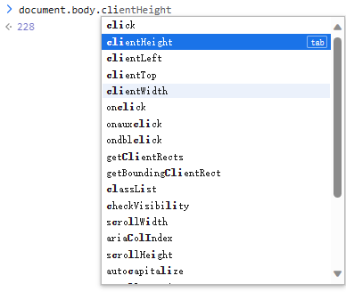

`注：某些宽高在样式计算的时候是计算不出来的，如：不是绝对值的节点`


- 包含快
- 匿名盒
  在布局树中，存在以下规则：
   - 内容必须在行盒中
   - 行盒和块盒不能相邻

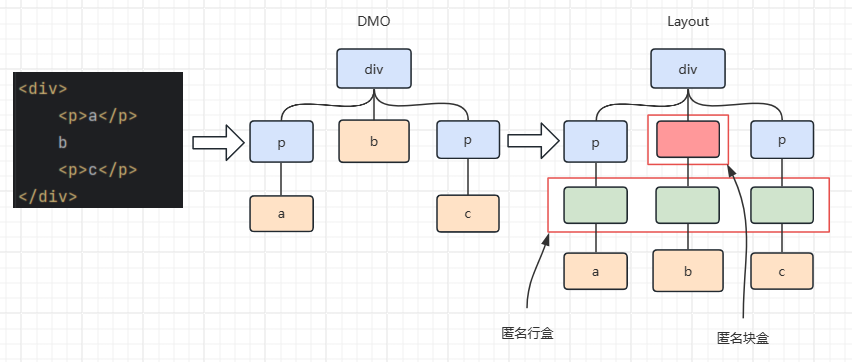

`谷歌浏览器源码位置：third_party/blink/renderer/core/layout`


### 4、分层
分层的目的在于优化，旧版本浏览器时没有这一步的，因为在后续中，页面会发生变化，变化会导致浏览器重新渲染整个页面，分层就将整个页面分成几个图层，当某个图层改变时，只重新渲染那个图层。
但是如何分层取决于内存的因素。这里涉及到浏览器的 重绘、回流。

- 回流
- 重绘
- 堆叠上下文

在不同浏览器中分层有不同的策略，图层是可以在控制台查看的，如：

- Edge：3d视图
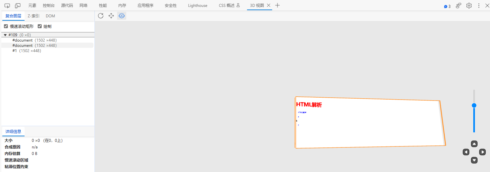
- Chrome: layers
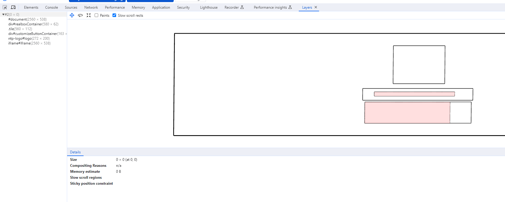

堆叠上下文、滚动条、transform、opacity 会影响分层策略，如`will-change : 变动的属性`，浏览器会自行决定是否将应用这个属性的容器进行单独分层。

对一些经常发生改变的元素进行独立分层，达到更快的渲染效果，如滚动条在分层时是独立的一个图层。

`注：不要滥用 will-change ，在渲染遇到分层导致的性能问题再使用，滥用会导致内存占用过高，导致奔溃`


### 5、绘制
这里的绘制，是为每一层生成如何绘制的指令，如：
1. 移动到 10，30 位置
2. 画一个200*300的矩形
3. 用红色填充

这里的绘制，就和canvas一样，canvas就是浏览内核暴露出来的绘制功能。

>这一步之后，其余工作将交于其他线程完成。

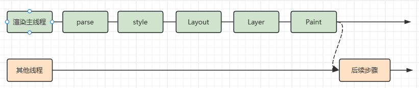

`谷歌浏览器绘制源码位置：third_party/blink/renderer/core/paint`

### 6、分块
### 7、光栅化
### 8、合成
### 9、显示

