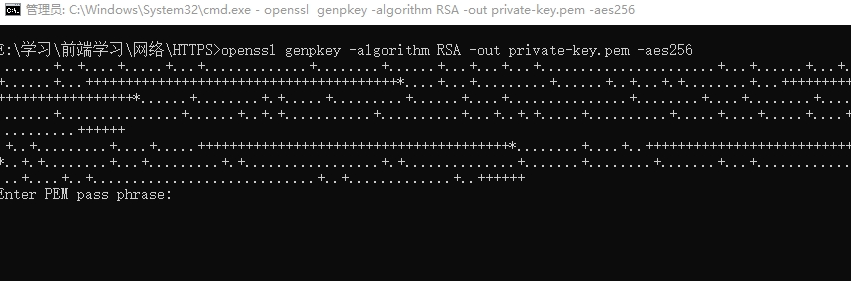
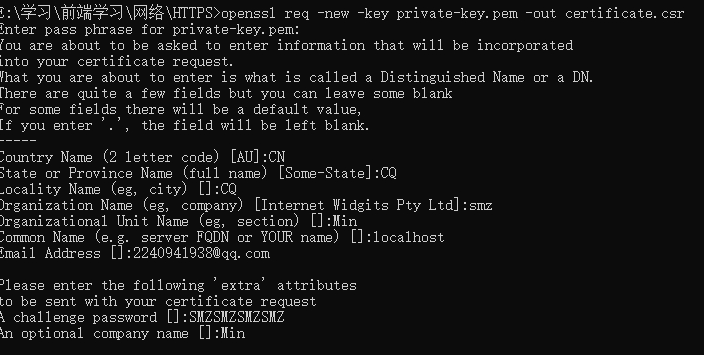
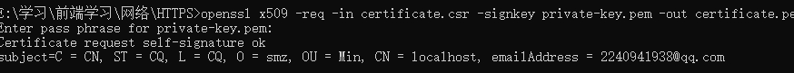
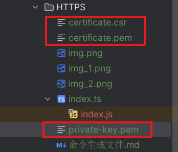

```powershell
openssl genpkey -algorithm RSA -out private-key.pem -aes256
```
- openssl: OpenSSL 命令行工具的名称。
- genpkey: 生成私钥的命令。
- -algorithm RSA: 指定生成 RSA 私钥。
- -out private-key.pem: 将生成的私钥保存为 private-key.pem 文件。
- -aes256: 为私钥添加 AES 256 位加密，以保护私钥文件不被未经授权的人访问。

>在之后需要一个密码短语并确认，在后续需要操作密钥文件的时候需要。

```powershell
Enter PEM pass phrase: 123456 
Verifying - Enter PEM pass phrase: 123456
```


>生成pem证书文件
```powershell
openssl req -new -key private-key.pem -out certificate.csr
```
- "req": 表示使用 X.509 证书请求管理器 (Certificate Request Management) 功能模块。
- "-new": 表示生成新的证书签名请求。
- "-key private-key.pem": 表示使用指定的私钥文件 "private-key.pem" 来加密证书签名请求中的密钥对。
- "-out certificate.csr": 表示输出生成的证书签名请求到文件 "certificate.csr" 中。该文件中包含了申请者提供的一些证书请求信息，例如公钥、授权主体的身份信息等。

>填写信息:

Country Name (2 letter code) []:CN  国家
State or Province Name (full name) []:CQ 省份
Locality Name (eg, city) []:CQ 城市
Organization Name (eg, company)SMZ 组织或者是个人
Organizational Unit Name (eg, section) []:Min 机构名称
Common Name (eg, fully qualified host name) []:localhost 域名
Email Address []: 邮箱地址
Please enter the following 'extra' attributes
to be sent with your certificate request
A challenge password []: SMZSMZSMZSMZ 密码加盐
An optional company name []:Min 公司名称



>生成数字证书：
```powershell
openssl x509 -req -in certificate.csr -signkey private-key.pem -out certificate.pem
```
- "x509": 表示使用 X.509 证书管理器功能模块。
- "-req": 表示从输入文件（这里为 "certificate.csr"）中读取证书签名请求数据。
- "-in certificate.csr": 指定要读取的证书签名请求文件名。
- "-signkey private-key.pem": 指定使用指定的私钥文件 "private-key.pem" 来进行签名操作。一般情况下，签名证书的私钥应该是和之前生成 CSR 的私钥对应的。
- "-out certificate.pem": 表示将签名后的证书输出到文件 "certificate.pem" 中。该文件中包含了签名后的证书信息，包括签名算法、有效期、公钥、授权主体的身份信息等。
- Enter pass phrase for private-key.pem: 密码短语







## nginx配置https

- openssl genrsa -out nginx.key 2048 （生成私钥）
- openssl req -new -key nginx.key -out nginx.csr（生成签名文件）
- openssl x509 -req -in nginx.csr -signkey nginx.key -out nginx.crt（生成证书）
